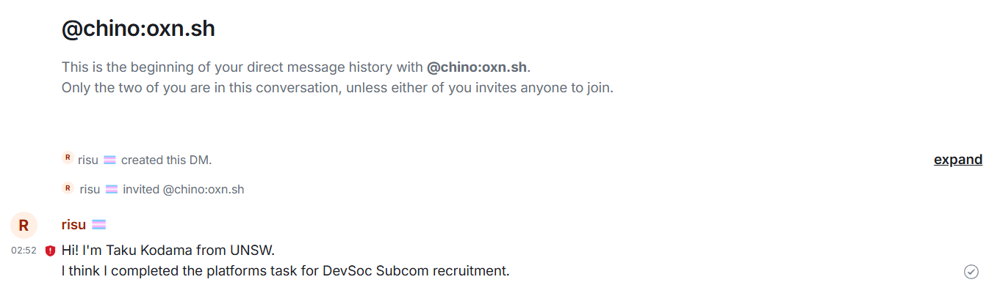

# DevSoc Subcommittee Recruitment: Platforms
Your task is to send a direct message to the matrix handle `@chino:oxn.sh` using the Matrix protocol. However, this message must be sent over a self hosted instance such as through the Conduwuit implementation or the slightly more complicated Synapse implementation.

For this to work your server must be federated, but you do not have to worry about specifics such as using your domain name as your handle (a subdomain will do!) or have other 'nice to have' features. Just a message will do!

**You should write about what you tried and your process in the answer box below.**

If you don't manage to get this working we'll still want to hear about what you tried, what worked and what didn't work, etc. Good luck!

---

> ANSWER BOX

## Summary

I hosted only the backend of the Matrix protocol using Conduwuit on an OCI instance with Ubuntu 24.04. I set up the SSL certificate using Let's Encrypt as it was required to connect to the server from app.element.io. Since I lacked knowledge about systemd, I struggled with the permission issues. Also, I initially tried to use Cloudflare proxy to configure port forwarding and SSL certificate, but it was not possible because the Cloudflare proxy doesn't allow port `8448`, which is required to federate with other servers. Finally I could send a direct message, but did many insecure things due to the lack of knowledge and time.

## Logs

Mainly just followed the instructions from Conduwuit [Generic deployment documentation](https://conduwuit.puppyirl.gay/deploying/generic.html).

1. Make a VCN named `matrix` in OCI using the VCN Wizard. For ease, just use the default settings.

2. Create a new compute instance named `conduwuit` in the public subnet of `matrix` VCN with the following settings:
    - Image: Ubuntu 24.04
    - Shape: VM.Standard.A1.Flex (1 OCPU, 6GB RAM)
    - Primary VNIC IP addresses: Automatically assign public IPv4 address

   Save the generated private key for SSH access.

3. Open [Termius](https://termius.com/) and SSH into the instance using the assigned IPv4 address and generated private key.

4. Upgrade the system packages:

    ```bash
    sudo apt update
    sudo apt upgrade -y
    ```

5. Install [mise-en-place](https://mise.jdx.dev) to manage the installation of Conduwuit:

    ```bash
    # https://mise.jdx.dev/installing-mise.html#apt
    sudo apt update -y && apt install -y gpg sudo wget curl
    sudo install -dm 755 /etc/apt/keyrings
    wget -qO - https://mise.jdx.dev/gpg-key.pub | gpg --dearmor | sudo tee /etc/apt/keyrings/mise-archive-keyring.gpg 1> /dev/null
    echo "deb [signed-by=/etc/apt/keyrings/mise-archive-keyring.gpg arch=arm64] https://mise.jdx.dev/deb stable main" | sudo tee /etc/apt/sources.list.d/mise.list
    sudo apt update
    sudo apt install -y mise
    ```

6. Activate mise:

    ```bash
    echo 'eval "$(mise activate bash --shims)"' | sudo tee -a /root/.bashrc
    sudo bash -c "source /root/.bashrc"
    ```

   Activate mise in the root because `systemd` services run as root.

7. Install Conduwuit:

    ```bash
    sudo mise use -g ubi:girlbossceo/conduwuit[matching=static]@0.5.0-rc3
    ```

8. Allow ingress traffic on the following ports in `Default Security List` of the `matrix` VCN:
    - Stateless: No
    - Source Type: CIDR
    - Source CIDR: 0.0.0.0/0
    - IP Protocol: TCP
    - Source Port Range: All
    - Destination Port Range: 443, 8448

9. Open the ports in iptables:

    ```bash
    sudo iptables -A INPUT -p tcp --dport 443 -j ACCEPT
    sudo iptables -A INPUT -p tcp --dport 8448 -j ACCEPT
    sudo netfilter-persistent save
    ```

10. Set up systemd service for Conduwuit:

    ```bash
    sudo mise doctor -J | jq -r .dirs.shims
    # copy from https://conduwuit.puppyirl.gay/configuration/examples.html#debian-systemd-unit-file
    # `ExecStart` should be the path to the shim shown by the above command followed by `/conduwuit`
    # `Environment` somehow doesn't work, so remove it and configure the config path with --config in ExecStart
    # e.g. `ExecStart=/root/.local/share/mise/shims/conduwuit --config /etc/conduwuit/conduwuit.toml`
    # remove `DynamicUser`, `User`, and `Group` as I don't create a separate user for Conduwuit
    # comment out `ProtectHome` as it causes permission issues with mise installed tools
    sudo nano /etc/systemd/system/conduwuit.service
    ```

    <details>
    <summary>`/etc/systemd/system/conduwuit.service`</summary>

    ```ini
    [Unit]
    Description=conduwuit Matrix homeserver
    Wants=network-online.target
    After=network-online.target
    Documentation=https://conduwuit.puppyirl.gay/

    [Service]
    Type=notify-reload
    ReloadSignal=SIGUSR1

    TTYPath=/dev/tty25
    DeviceAllow=char-tty
    StandardInput=tty-force
    StandardOutput=tty
    StandardError=journal+console
    TTYReset=yes
    # uncomment to allow buffer to be cleared every restart
    TTYVTDisallocate=no

    TTYColumns=120
    TTYRows=40

    ExecStart=/root/.local/share/mise/shims/conduwuit --config /etc/conduwuit/conduwuit.toml

    ReadWritePaths=/var/lib/conduwuit /etc/conduwuit

    #AmbientCapabilities=
    #CapabilityBoundingSet=

    DevicePolicy=closed
    LockPersonality=yes
    MemoryDenyWriteExecute=yes
    NoNewPrivileges=yes
    #ProcSubset=pid
    ProtectClock=yes
    ProtectControlGroups=yes
    #ProtectHome=yes
    ProtectHostname=yes
    ProtectKernelLogs=yes
    ProtectKernelModules=yes
    ProtectKernelTunables=yes
    ProtectProc=invisible
    ProtectSystem=strict
    PrivateDevices=yes
    PrivateMounts=yes
    PrivateTmp=yes
    #PrivateUsers=yes
    PrivateIPC=yes
    RemoveIPC=yes
    RestrictAddressFamilies=AF_INET AF_INET6 AF_UNIX
    RestrictNamespaces=yes
    RestrictRealtime=yes
    RestrictSUIDSGID=yes
    SystemCallArchitectures=native
    SystemCallFilter=@system-service @resources
    SystemCallFilter=~@clock @debug @module @mount @reboot @swap @cpu-emulation @obsolete @timer @chown @setuid @privileged @keyring @ipc
    SystemCallErrorNumber=EPERM
    #StateDirectory=conduwuit

    RuntimeDirectory=conduwuit
    RuntimeDirectoryMode=0750

    Restart=on-failure
    RestartSec=5

    TimeoutStopSec=2m
    TimeoutStartSec=2m

    StartLimitInterval=1m
    StartLimitBurst=5

    [Install]
    WantedBy=multi-user.target
    ```

    </details>

11. Create a Conduwuit configuration file:


    ```bash
    sudo mkdir /etc/conduwuit
    # copy from https://conduwuit.puppyirl.gay/configuration/examples.html#example-configuration
    sudo nano /etc/conduwuit/conduwuit.toml
    ```

    - `server_name` must be uncommented and set to `"matrix.risunosu.com"`, the domain I own
    - `database_path` must be uncommented and set to `"/var/lib/conduwuit"`
    - `allow_registration` must be set to `true` to allow registration of new users
    - `registration_token_file = "/etc/conduwuit/.reg_token"` is required to allow registration of new users
    - `allow_federation` must be set to `true` to allow federation

    The configuration file can be found in [./conduwuit.toml](./conduwuit.toml).

12. Install caddy for reverse proxy:

    ```bash
    sudo mise use -g aqua:caddyserver/caddy
    ```

13. Set up systemd service for Caddy:

    ```bash
    sudo mise doctor -J | jq -r .dirs.shims
    # copy from https://github.com/caddyserver/dist/blob/master/init/caddy.service
    # `ExecStart` and `ExecReload` should be the path to the shim shown by the above command followed by `/caddy`
    # remove `User` and `Group` as I don't create a separate user for Caddy
    sudo nano /etc/systemd/system/caddy.service
    ```

    <details>
    <summary>`/etc/systemd/system/caddy.service`</summary>

    ```ini
    # caddy.service
    #
    # For using Caddy with a config file.
    #
    # Make sure the ExecStart and ExecReload commands are correct
    # for your installation.
    #
    # See https://caddyserver.com/docs/install for instructions.
    #
    # WARNING: This service does not use the --resume flag, so if you
    # use the API to make changes, they will be overwritten by the
    # Caddyfile next time the service is restarted. If you intend to
    # use Caddy's API to configure it, add the --resume flag to the
    # `caddy run` command or use the caddy-api.service file instead.

    [Unit]
    Description=Caddy
    Documentation=https://caddyserver.com/docs/
    After=network.target network-online.target
    Requires=network-online.target

    [Service]
    Type=notify
    ExecStart=/root/.local/share/mise/shims/caddy run --environ --config /etc/caddy/Caddyfile
    ExecReload=/root/.local/share/mise/shims/caddy reload --config /etc/caddy/Caddyfile --force
    TimeoutStopSec=5s
    LimitNOFILE=1048576
    PrivateTmp=true
    ProtectSystem=full
    AmbientCapabilities=CAP_NET_ADMIN CAP_NET_BIND_SERVICE

    [Install]
    WantedBy=multi-user.target
    ```

    </details>

14. Create a Caddyfile:

    ```bash
    # copy from https://conduwuit.puppyirl.gay/deploying/generic.html#caddy
    # `/etc/caddy/conf.d/` seems not to work, so use `/etc/caddy/Caddyfile`
    # substitute `your.server.name` with `matrix.risunosu.com`
    # use 8008 as the port instead of 6167 as the default port of Conduwuit is 8008
    sudo nano /etc/caddy/Caddyfile
    ```

    <details>
    <summary>`/etc/caddy/Caddyfile`</summary>

    ```caddy
    matrix.risunosu.com, matrix.risunosu.com:8448 {
        # TCP reverse_proxy
        reverse_proxy 127.0.0.1:8008
        # UNIX socket
        #reverse_proxy unix//run/conduwuit/conduwuit.sock
    }
    ```

    </details>

15. Start and enable the services:

    ```bash
    sudo systemctl enable --now caddy
    sudo systemctl enable --now conduwuit
    ```

16. Add a DNS record for the domain `matrix.risunosu.com` to point to the public IP address of the instance in Cloudflare.

17. Create a [Configuration rule](https://developers.cloudflare.com/rules/configuration-rules/) in Cloudflare to set the encryption mode to `Flexible` for the domain `matrix.risunosu.com`:

    - Expression: `(http.host eq "matrix.risunosu.com")`
    - SSL: Flexible

   This is required as the instance does not have an SSL certificate, but I need to use HTTPS to use `app.element.io`.  
   The flexible mode is not recommended for production because the connection between Cloudflare and the server is not encrypted, but I don't want to configure SSL certificates for the origin.

Here, I noticed the reverse proxy is not required as I use Cloudflare. So, I disabled Caddy:

```bash
sudo systemctl disable --now caddy
```

Also, I changed the security list of OCI and iptables to allow TCP traffic on port 8008.

```bash
sudo iptables -A INPUT -p tcp --dport 8008 -j ACCEPT
sudo iptables -L INPUT --line-number
sudo iptables -D INPUT <line number of 443>
sudo iptables -L INPUT --line-number
sudo iptables -D INPUT <line number of 8448>
sudo netfilter-persistent save
```

However, `sudo ss -tulnp` doesn't show any process listening on port `8008` when I set `global.address` in the Conduwuit config to the IPv4 address of the instance, while it shows `8008` when I set `global.address` to `127.0.0.1`.  
This is the same even if I run Conduwuit manually with `sudo /root/.local/share/mise/shims/conduwuit --config /etc/conduwuit/conduwuit.toml`.  
Also, if I try to connect with curl, it shows `curl: (7) Failed to connect to 64.110.97.211 port 8008 after 379 ms: Couldn't connect to server`.  
Since even a simple web server with Bun cannot be accessed from the public IP address, the issue should be firewall related.

The cause was miss-ordering of the iptables rules. The rules should be added before the `REJECT` rule, but it was:

```plaintext
-A INPUT -m state --state RELATED,ESTABLISHED -j ACCEPT
-A INPUT -p icmp -j ACCEPT
-A INPUT -i lo -j ACCEPT
-A INPUT -p udp -m udp --sport 123 -j ACCEPT
-A INPUT -p tcp -m state --state NEW -m tcp --dport 22 -j ACCEPT
-A INPUT -j REJECT --reject-with icmp-host-prohibited
-A INPUT -p tcp -m tcp --dport 8008 -j ACCEPT
```

I reordered the rules then the server got accessible from the public IP address. Really stupid mistake took me hours to figure out.

Then, the next step is to setup proxy server to forward the traffic on both `443` and `8448` to `8008`.  
I tried to use `443` in the origin, but it threw an error `curl: (35) OpenSSL/3.0.13: error:0A00010B:SSL routines::wrong version number` because I didn't configure SSL certificates for the origin.  
I should configure it but I don't want to for now, so I use `8008` in the origin.

1. Create a [Origin rule](https://developers.cloudflare.com/rules/origin-rules/) in Cloudflare to forward the traffic on both `443` and `8448` to `8008`, actually, forward all traffic to `8008`:

    - Expression: `(http.host eq "matrix.risunosu.com")`
    - Destination Port: Rewrite to `8008`

2. Edit `/etc/conduwuit/conduwuit.toml` to set `global.address` to `"0.0.0.0"`, and `global.port` to `8008`.

3. Re-enable the Conduwuit service:

    ```bash
    sudo systemctl enable --now conduwuit
    ```

Then, `https://matrix.risunosu.com` returns `hewwo from conduwuit woof!` as expected.  
Of course, `https://matrix.risunosu.com:443` also returns the same response, but `https://matrix.risunosu.com:8448` cannot be accessed because Cloudflare doesn't allow the port not listed [here](https://developers.cloudflare.com/fundamentals/reference/network-ports/).

For now, at least I can access the server without federation, so I'll try to create an account using [`app.element.io`](https://app.element.io/#/register).

1. Create `/etc/conduwuit/.reg_token` and set the registration token:

    ```bash
    sudo nano /etc/conduwuit/.reg_token
    ```

2. Register a new account using [`app.element.io`](https://app.element.io/#/register) with the homeserver `matrix.risunosu.com`.

Yay! I successfully registered a new account on the self-hosted Matrix server!

However, as I expected, I cannot send a direct message to `@chino:oxn.sh` because the user cannot be found.  
I checked the federation availability using [`Matrix federation tester`](https://federationtester.matrix.org/#matrix.risunosu.com), and it shows `Connection Errors`.  
Hence, I need to forward or open port `8448` somehow.  
I think the only way to achieve this is to disable Cloudflare proxy by setting the `matrix` subdomain to [DNS-only](https://developers.cloudflare.com/dns/proxy-status/#dns-only-records), then configure the SSL certificate for the origin.  
I don't care much about the safety of the connection, but `app.element.io` requires HTTPS to connect to the server.

1. Create a [Cloudflare Origin CA certificate](https://developers.cloudflare.com/ssl/origin-configuration/origin-ca/) for the domain `matrix.risunosu.com`:

    - Generate private key and CSR with Cloudflare
    - Private key type: `RSA (2048)`
    - Hostnames: `matrix.risunosu.com`
    - Certificate validity: `90 days`

2. Copy generated private key and certificate to the instance:

    ```bash
    sudo nano /etc/conduwuit/matrix.risunosu.com.key
    sudo nano /etc/conduwuit/matrix.risunosu.com.crt
    ```

3. Configure `/etc/conduwuit/conduwuit.toml` to use the certificate:

    ```toml
    [global.tls]

    # Path to a valid TLS certificate file.
    #
    # example: "/path/to/my/certificate.crt"
    #
    certs = "/etc/conduit/matrix.risunosu.com.crt"

    # Path to a valid TLS certificate private key.
    #
    # example: "/path/to/my/certificate.key"
    #
    key = "/etc/conduit/matrix.risunosu.com.key"
    ```

    Also, uncomment `trusted_servers = ["matrix.org"]` to allow gathering public keys.

4. Use ports `443` and `8448` directly in the Conduwuit config and open the ports in iptables and OCI security list.

5. Restart the Conduwuit service:

    ```bash
    sudo systemctl restart conduwuit
    ```

6. Remove the Configuration rule and Origin rule in Cloudflare, and set the `matrix` subdomain to [DNS-only](https://developers.cloudflare.com/dns/proxy-status/#dns-only-records).

Then I tried to connect to the Conduwuit but I couldn't. To simplify the problem, I tried to connect to a simple web server with Bun, but I couldn't connect to it either with an SSL error:

```plaintext
curl: (60) SSL certificate problem: unable to get local issuer certificate
More details here: https://curl.se/docs/sslcerts.html

curl failed to verify the legitimacy of the server and therefore could not
establish a secure connection to it. To learn more about this situation and
how to fix it, please visit the web page mentioned above.
```

I could connect to the server with `curl -k` to ignore the SSL error, so it is a problem of the SSL certificate.  
Then, I noticed that the Cloudflare Origin CA certificate is not trusted by default.

> Site visitors may see untrusted certificate errors if you pause Cloudflare or disable proxying on subdomains that use Cloudflare origin CA certificates. These certificates only encrypt traffic between Cloudflare and your origin server, not traffic from client browsers to your origin.
https://developers.cloudflare.com/ssl/origin-configuration/origin-ca/#3-change-ssltls-mode

It was written clearly in the docs, but I didn't notice it. Since I need to disable proxying on the subdomain to use the port `8448`, I cannot use the Cloudflare Origin CA certificate.  
The next alternative is to use Let's Encrypt, or to use the [OCI Certificates](https://www.oracle.com/au/security/cloud-security/ssl-tls-certificates/) service.  
Since it seems to be a bit complicated to use OCI Certificates, I'll try to use Let's Encrypt.

There are both [HTTP-01](https://letsencrypt.org/docs/challenge-types/#http-01-challenge) and [DNS-01](https://letsencrypt.org/docs/challenge-types/#dns-01-challenge) challenges to verify the ownership in the ACME standard.  
For this case, I'll use the HTTP-01 challenge because I don't want to save the Cloudflare API token in the instance.  
I'll use [Certbot](https://certbot.eff.org/) to get the certificate, so follow this [instruction](https://certbot.eff.org/instructions?ws=other&os=snap&tab=standard).

1. Install Certbot:

    ```bash
    sudo apt-get remove certbot
    sudo snap install --classic certbot
    ```

2. Open port `80` in iptables and OCI security list.

3. Get the certificate:

    ```bash
    sudo certbot certonly --standalone
    ```

    ```plaintext
    Successfully received certificate.
    Certificate is saved at: /etc/letsencrypt/live/matrix.risunosu.com/fullchain.pem
    Key is saved at:         /etc/letsencrypt/live/matrix.risunosu.com/privkey.pem
    ```

4. Configure `/etc/conduwuit/conduwuit.toml` to use the certificate:

    ```toml
    [global.tls]

    # Path to a valid TLS certificate file.
    #
    # example: "/path/to/my/certificate.crt"
    #
    certs = "/etc/letsencrypt/live/matrix.risunosu.com/fullchain.pem"

    # Path to a valid TLS certificate private key.
    #
    # example: "/path/to/my/certificate.key"
    #
    key = "/etc/letsencrypt/live/matrix.risunosu.com/privkey.pem"
    ```

5. Start the Conduwuit service:

    ```bash
    sudo systemctl restart conduwuit
    ```

However, I still couldn't connect to the server somehow. I could conect with port `8448` but not with `443`.  
I tried to connect to the simple web server with Bun on port `443`, then I could connect to it.  
Also, when I tried to run Conduwuit manually with `sudo /root/.local/share/mise/shims/conduwuit --config /etc/conduwuit/conduwuit.toml`, I could connect to the server with port `443`.  
Since we need a special permission to use ports under `1024`, the problem is the systemd unit file.  
I found that the `AmbientCapabilities` and `CapabilityBoundingSet` are set to empty in the systemd unit file, so I commented them out:

```ini
#AmbientCapabilities=
#CapabilityBoundingSet=
```

However, it was not enough to solve the problem. I also need to comment out `PrivateUsers=yes`.  
Then, I could connect to the server with port `443` as well.

Finally, I sent a direct message to `@chino:oxn.sh` from `app.element.io` using the self-hosted Matrix server!  
Since I'm doing many insecure things, I need to terminate the instance after the review.  
Below is the screenshot of the direct message:



The following list is the improvements I can make if I do this again:

- Do not use mise-en-place for root user as it requires to use `sudo` for every command.
- Use a reverse proxy not to give extra permissions to the Conduwuit service.
- Create separate users for Conduwuit and Caddy.
- Get the SSL certificate using OCI Certificates service to automate the renewal with minimal configuration in the instance.
- Host the frontend of the Matrix protocol to avoid CORS issues as documented.
- Edit `/etc/iptables/rules.v4` directly to avoid the issue of the order of the rules.
